# YOLOv8s: Детекция касок и жилетов на производстве

Цель: практика в использовании YOLO-модели для детекции средств индивидуальной защиты (каска / светоотражающий жилет) на производственных снимках. Задача соответствует профилю компаний в области промышленной видеоаналитики — автоматическому контролю соблюдения требований охраны труда в реальном времени.

Ноутбук: [Google Colab]()

### Стек

- Python
- [Ultralytics YOLOv8](https://github.com/ultralytics/ultralytics) — обучение и инференс
- PIL, NumPy, Matplotlib — EDA и визуализация
- Google Colab GPU runtime (CUDA Tesla T4)

## Датасет

**Источник:** [Hardhat Detection — Roboflow Universe](https://universe.roboflow.com/luanvan-wgmqx/hardhat-umya7/dataset/1)

**License**: CC BY 4.0


**Классы:** `hardhat` (`0`), `vest` (`1`)

**Предобработка Roboflow:** Auto-Orient + Resize до 416×416 (stretch). Аугментации в датасете вручную не применялись — ultralytics добавляет их автоматически при обучении.

### структура датасета

```
/content/dataset_roboflow_yolo8
├── train
│   ├── images
│   │   ├── pos_1_jpg.rf.3d1..d53.jpg
│   │   ├── pos_2_jpg.rf.18c..3dd.jpg
│   │   └── ...
│   └── labels
│       ├── pos_1_jpg.rf.3d1..d53.txt
│       ├── pos_2_jpg.rf.18c..3dd.txt
│       └── ...
├── test
│   ├── images
│   │   └── ...
│   └── labels
│       └── ...
├── valid
│   ├── images
│   │   └── ...    
│   └── labels
│       └── ...
│
├── README.dataset.txt
├── README.roboflow.txt
└── data.yaml
```


| Сплит | Доля | Изображений |
|---|---|---|
| train | 70% | 1502 |
| valid | 20% | 429 |
| test | 10% | 215 |

### Формат разметки — YOLOv8

```
( class_id      cx      cy       w       h )
         0  0.8004  0.2764  0.3016  0.3245
         0  0.5084  0.2163  0.2776  0.3305
         1  0.8485  0.7475  0.3004  0.4567
         1  0.5841  0.6213  0.4242  0.4146
```
где `cx`, `cy` — координаты центра bbox, `w`, `h` — размеры bbox

Все 4 параметра bbox нормализованы до [0, 1]. Описание координат bbox через центр (а не через левый верхний угол) — это принципиальное отличие YOLO-формата от Pascal VOC (x1, y1, x2, y2).

Изображения, bbox-разметка которого приведена в качестве примера выше:

<div align="center">
    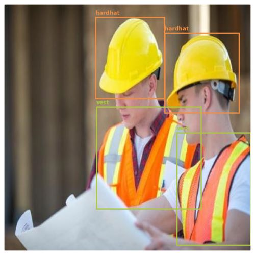
</div>

Пример изображений с разметкой из train-выборки:

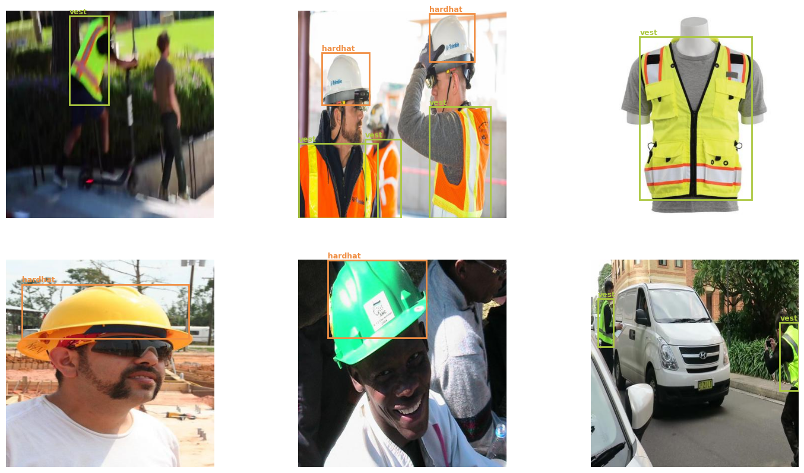

## EDA

### Распределение классов

<div align="center">
    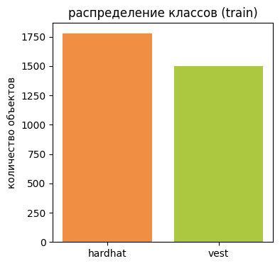
</div>

Суммарно train-выборке присутствует порядка 1750 объектов класса `hardhat` и 1500 объектов `vest` — классы близко сбалансированы, что упрощает обучение.

### Состав изображений по классам

<div align="center">
    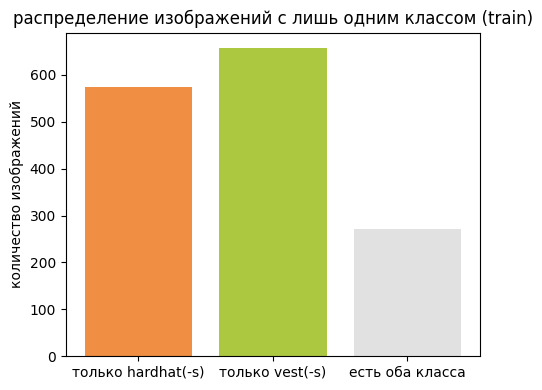
</div>

Около 580 изображений содержат только каски, и 650 — только жилеты, порядка 300 — оба класса одновременно.

### Размеры bbox по классам

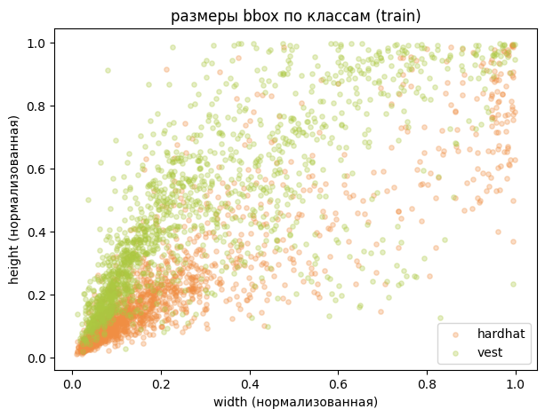

Зависимость линейная для обоих классов, но есть характерное отличие: 
- bbox `hardhat` тяготеют к горизонтальным пропорциям (ширина > высота), 
- а `vest` — к вертикальным.

Это ожидаемо исходя из физической формы объектов и имеет прямое следствие для anchor-based детекторов — при использовании дефолтных anchor-боксов с разными aspect ratio каждый класс будет "захвачен" разными якорями. YOLOv8 (anchor-free) решает эту проблему через предсказание распределения границ bbox (DFL loss).

### Плотность центров bbox

<div align="center">
    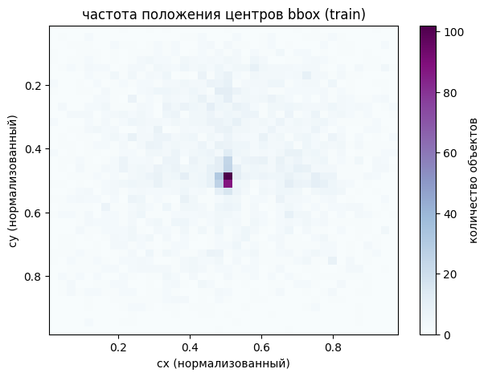
</div>

Это говорит о том что датасет собран преимущественно из изображений где объекты находятся в центральной зоне. 

На production-камерах с фиксированным углом обзора это зачастую не так, так что модель может хуже работать на периферии кадра.

### Количество объектов на изображении

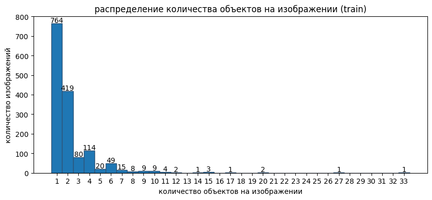

Максимум обеъктов — 1 изображение с 33 объектами (групповое фото рабочих):

<div align="center">
    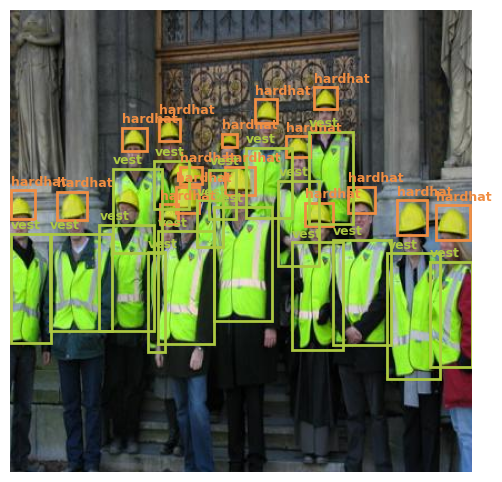
</div>

Такие плотные сцены представляют наибольшую сложность для детектора — высокая вероятность перекрытий между bbox и ложных срабатываний NMS.

## Архитектура модели

### Почему YOLOv8, а не SSD или Faster R-CNN

Для задачи промышленной безопасности в реальном времени критичны два требования: скорость инференса (видеопоток 24/7) и достаточная точность. YOLOv8 обеспечивает оба (три модели выбраны как репрезентативные точки эволюции детекторов):

| Критерий | YOLOv8s | SSD | Faster R-CNN |
|---|---|---|---|
| Парадигма | one-stage | one-stage | two-stage |
| Anchor | anchor-free | anchor-based | anchor-based |
| Скорость | высокая | средняя | низкая |
| Точность | высокая | средняя | высокая |
| Подходит для реал-тайм | да | да | нет |
| Актуальность | индустриальный стандарт | устарел | нишевое применение |


SSD требует ручного задания anchor-боксов под датасет. YOLOv8 anchor-free: предсказывает распределение над возможными положениями границ bbox (Distribution Focal Loss), что устраняет этот гиперпараметр и улучшает точность на объектах с нестандартными пропорциями.

### Структура YOLOv8s

YOLOv8 состоит из трёх частей:

**Backbone (экстрактор признаков):**
```
Conv(3→32, 3×3, stride=2)       # 416→208, даунсемплинг
Conv(32→64, 3×3, stride=2)      # 208→104
C2f(64→64, 1 блок)              # CSP-блок с bottleneck
Conv(64→128, 3×3, stride=2)     # 104→52
C2f(128→128, 2 блока)
Conv(128→256, 3×3, stride=2)    # 52→26
C2f(256→256, 2 блока)
Conv(256→512, 3×3, stride=2)    # 26→13
C2f(512→512, 1 блок)
SPPF(512→512)                   # Spatial Pyramid Pooling Fast
```

**Neck (FPN — объединение многомасштабных признаков):**
```
Upsample(×2) + Concat с C2f(256)  # 13→26, объединение с крупным feature map
C2f(768→256)
Upsample(×2) + Concat с C2f(128)  # 26→52
C2f(384→128)                       # → feature map P3 (мелкие объекты)
Conv(128→128, stride=2) + Concat   # → feature map P4 (средние объекты)
C2f(384→256)
Conv(256→256, stride=2) + Concat   # → feature map P5 (крупные объекты)
C2f(768→512)
```

**Head (предсказание bbox и классов):**
```
Detect([P3, P4, P5], n_classes=2)
```

Итого: **130 слоёв, 11,136,374 параметра, 28.6 GFLOPs**

C2f (Cross Stage Partial with 2 convolutions) — ключевой блок YOLOv8: объединяет признаки через skip connection без полного повторного вычисления, что снижает количество параметров при сохранении градиентного потока.

SPPF применяет MaxPool с окном 5×5 трижды последовательно — эффективная замена классического SPP, захватывает глобальный контекст (аналог большого рецептивного поля) за меньшее время.

Neck реализует FPN (Feature Pyramid Network): признаки с трёх масштабов (P3=52×52, P4=26×26, P5=13×13) объединяются через апсемплинг и конкатенацию. P3 детектирует мелкие объекты (каски на дальнем плане), P5 — крупные (жилет вблизи). Это принципиальное преимущество над YOLOv1 с одним масштабом.

Информация о структуре взята из логов обучения модели.

### Transfer Learning

Использовались предобученные веса `yolov8s.pt` (обучение на COCO, 80 классов). При инициализации перенесено **349 из 355** слоёв — все слои backbone и neck, кроме головы Detect (она инициализирована случайно под наш датасет с 2 классами). Это ускорило сходимость: уже на эпохе 1 получен mAP50=0.629, тогда как обучение с нуля потребовало бы значительно больше эпох для извлечения базовых признаков.

### Аугментации

Ultralytics автоматически применяет аугментации в процессе обучения (не в датасете):
- **Mosaic** (первые 40 эпох) — склейка 4 изображений в одно, значительно увеличивает контекстное разнообразие и количество объектов на батч
- **Albumentations:** Blur, MedianBlur, ToGray, CLAHE (каждый с p=0.01)
- После эпохи 40: отключение mosaic для финальной сходимости

Отключение mosaic на последних 10 эпохах — стандартная практика в YOLOv8: mosaic сильно искажает реальное распределение объектов, и модель в финале должна видеть реалистичные изображения.

### Оптимизатор

```
AdamW(lr=0.001667, momentum=0.9)
  weight groups:
    57 параметров (decay=0.0)    # bias
    64 параметра (decay=0.0005)  # веса
    63 параметра (decay=0.0)     # BN
```

Ultralytics автоматически определил AdamW с `lr=0.001667` (= 0.01 / 6, что соответствует warm-up стратегии для batch=16).

## Обучение

**Конфигурация:**
```python
model.train(
    data='data.yaml',
    epochs=50,
    imgsz=416,    # совпадает с размером в датасете, нет лишнего ресайза
    batch=16,
    device=0      # Tesla T4
)
```

**Время:** ~15 минут на Tesla T4

### Динамика лоссов и метрик

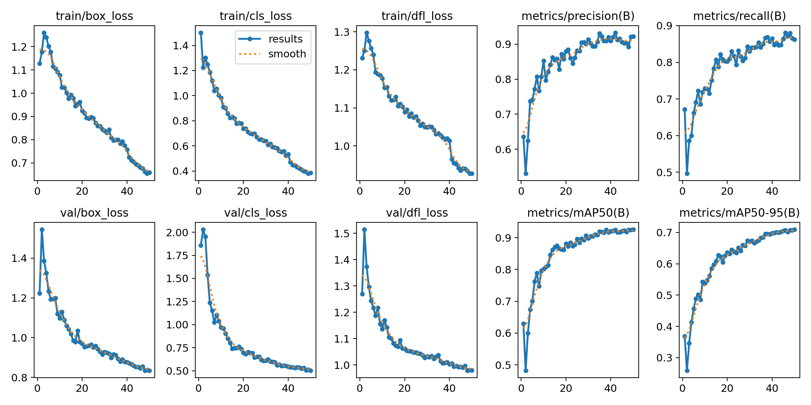

**Лоссы (box_loss, cls_loss, dfl_loss)** монотонно убывают на протяжении всех 50 эпох. Интересная особенность: после эпохи 40 (отключение mosaic) темп снижения лоссов заметно ускоряется — модель получает более реалистичные изображения и быстрее уточняет параметры.

**Метрики на val** растут менее монотонно — сильнее осциллирует. Наиболее интенсивный рост mAP50 приходится на первые 20 эпох, что типично для fine-tuning: backbone уже знает базовые признаки, и модель быстро адаптирует голову под новые классы.

### Итоговые метрики (best checkpoint)

| Class | Images | Instances | Precision | Recall | mAP50 | mAP50-95 |
|---|---|---|---|---|---|---|
| **all** | 429 | 964 | 0.922 | 0.863 | **0.925** | **0.709** |
| hardhat | 245 | 566 | 0.914 | 0.830 | 0.903 | 0.628 |
| vest | 240 | 398 | 0.930 | 0.896 | 0.948 | 0.790 |

**mAP50 = 0.925** — высокий результат для 50 эпох и небольшого датасета (1502 train). Достигнут за счёт transfer learning с COCO: backbone уже умел детектировать людей и их части, каски и жилеты являются надстройкой над этими признаками.

**vest детектируется лучше hardhat** (mAP50: 0.948 vs 0.903). Предположительная причина: жилеты занимают большую площадь bbox, имеют яркий цвет, поэтому более высокий средний confidence на тесте. Каски меньше по размеру особенно на дальнем плане и чаще теряются в фоне.

**mAP50-95** (строгая метрика с усреднением по порогам IoU от 0.5 до 0.95) значительно ниже — 0.709 vs 0.925. Это типично: при IoU=0.75+ модель должна очень точно предсказывать координаты bbox, что сложнее для мелких объектов.

### Confusion Matrix

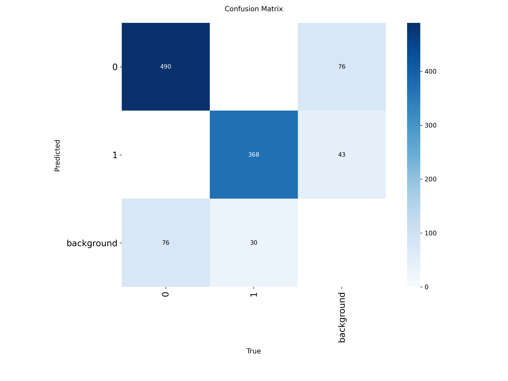

**Межклассовых ошибок нет** — модель никогда не путает каску с жилетом и наоборот. Классы визуально совершенно различны (форма, расположение на теле, цветовая гамма).

**Единственный тип ошибок — класс vs фон.** Hardhat теряется в фоне чаще (76 пропуска), чем vest (30 пропуска). Для ложного срабатывания на ground-truth фоне -- аналогично.

## Инференс

### Предсказания на тестовой выборке

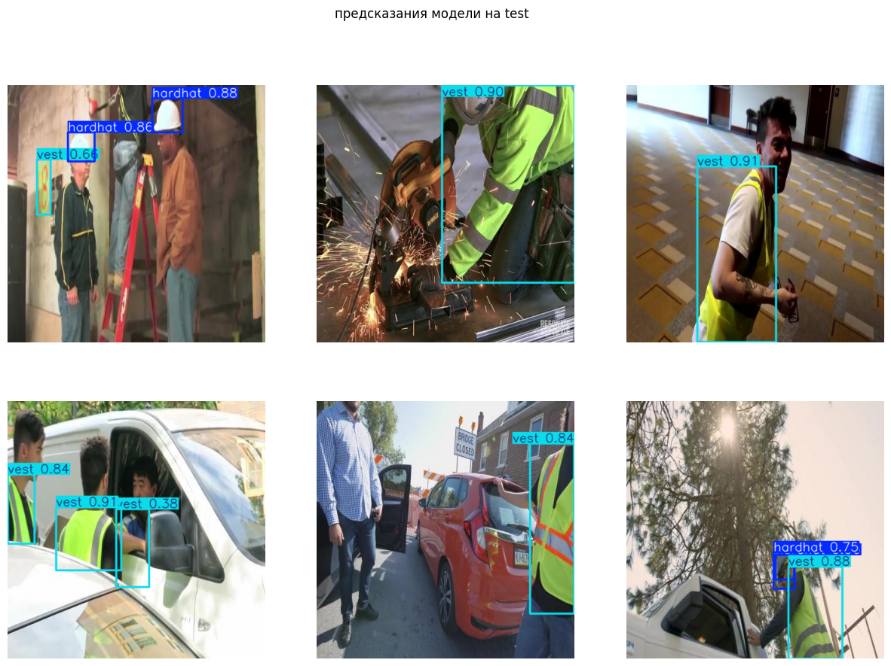

Модель уверенно детектирует оба класса при разных углах съёмки, освещении и расстояниях.

### Анализ случаев с низким confidence

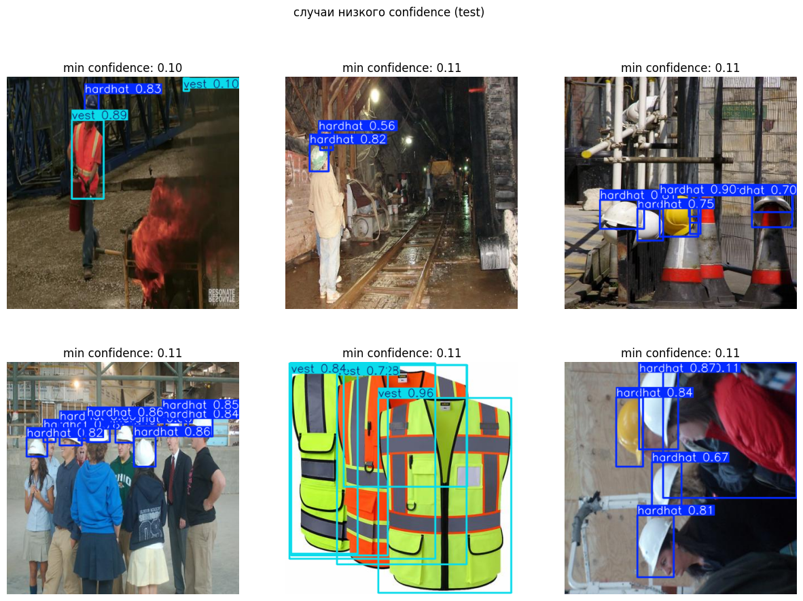

Основные паттерны низкого confidence:

- **Мелкие bbox** — объекты на дальнем плане (каски на расстоянии), где P3 (52×52) не даёт достаточного разрешения признаков
- **Частичная окклюзия** — объект перекрыт другим человеком или элементом конструкции

### Распределение confidence по классам

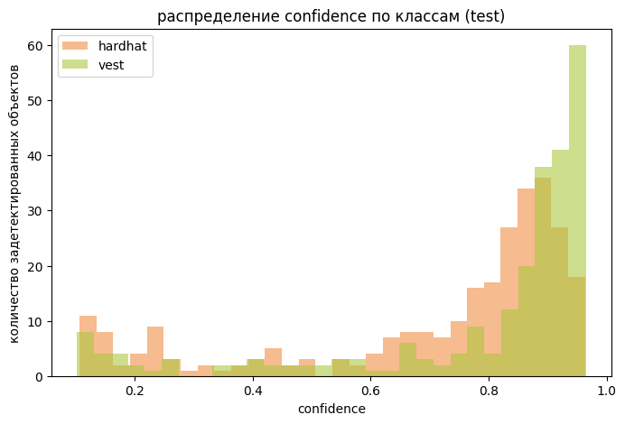

Характерное двугорбое распределение: небольшой локальный максимум около 0 (false positives с низкой уверенностью, которые срезаются повышением threshold) и основной пик в зоне высокого confidence (>0.7).

Для `hardhat` пик приходится на ~0.85 и затем идёт спад, для `vest` пик смещён к правой границе (>0.95) — vest детектируется с большей уверенностью, что согласуется с mAP50 по классам.

### Зависимость confidence от размера объекта

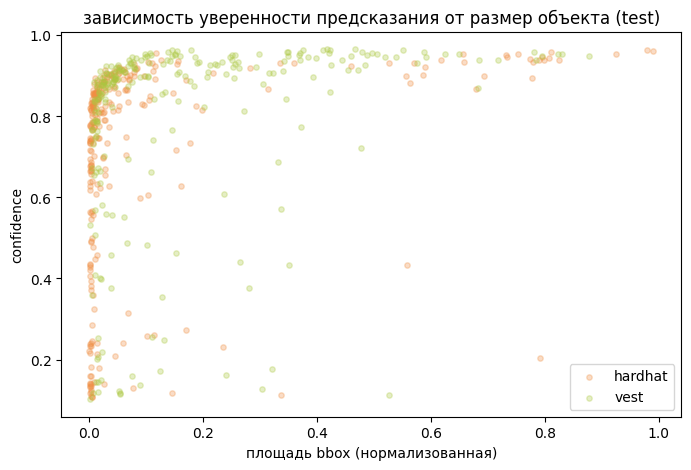

Confidence гиперболически зависит от размера объекта: при нормализованной площади ниже 0.025 модель неуверена, в то время как для бОльших размеров bbox confidence модели становится в среднем больше 0.5

## Выводы

Модель достигла **mAP50 = 0.925** на тестовой выборке за 50 эпох (~15 минут на Tesla T4), что демонстрирует эффективность transfer learning с COCO для узкодоменных промышленных задач.

Ключевые наблюдения из анализа результатов:

- Межклассовая путаница отсутствует полностью — единственный тип ошибок это пропуски мелких объектов на дальнем плане и ложно срабатывание на том же дальнем плане, что напрямую связано с ограничением разрешения feature map P3 (52×52 при imgsz=416)
- `vest` (жилет) детектируется устойчивее `hardhat` (каски) (mAP50: 0.948 vs 0.903) — следствие большей площади bbox на реальных производственных снимках и более высокой цветовой контрастности жилета
- Confidence гиперболически зависит от размера объекта: при нормализованной площади ниже 0.025 модель неуверена, что критично учитывать при выборе порога для production-системы
- Датасет смещён в сторону центральной зоны кадра — при развёртывании на камерах с нестандартным углом обзора модель может потребовать дообучения на доменных данных

## Environment

```python
Python:       3.12.13
Ultralytics:  8.4.67
PIL:          11.3.0
NumPy:        2.0.2
Matplotlib:   3.10.0
 ```

